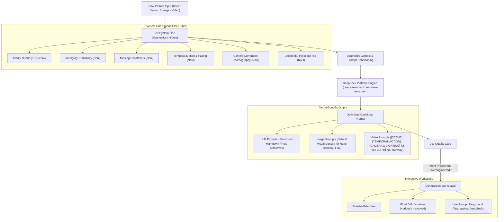

<p align="center">
  <h1 align="center">Prompt Optimizer</h1>
</p>

<p align="center">
  <strong>Production-grade prompt engineering workbench powered by DeepSeek Platform Flash API and TypeSafe Jev System One diagnostics. Zero-CORS, client-first, real-time rubric linting, and token-level diff visualization.</strong>
</p>

<p align="center">
  <a href="https://nodaysidle-prompt-optimizer.vercel.app"></a>
  
  
  
  
  
</p>

---

> **The Problem:** Crafting robust, production-grade LLM and image prompts is slow and guesswork-heavy. Users paste vague inputs into monolithic rewriters without knowing *what* is wrong (missing boundary constraints, ambiguous scope, lack of negative criteria, jailbreak susceptibility), and client-side web apps often suffer from browser CORS failures and leaked API keys.
>
> **The Result:** Prompt Optimizer combines **TypeSafe Jev's sub-100ms System One probabilistic rubric diagnostics** with **DeepSeek Platform's high-throughput flash-tier engine**. It instantly lints input prompts across 5 dimensions, conditions the rewrite on the detected flaws, runs a quality gate to verify intent preservation, highlights word-level diffs, and provides an in-browser live playground.

---

## ⚡ Architecture Flow



---

## 🚀 Key Features

| Feature | Description | Engine / Mechanism |
|---|---|---|
| **System One Rubric Linter** | Sub-100ms probabilistic evaluation of prompt clarity, ambiguity, missing negative constraints, temporal motion dynamics, and camera choreography. | TypeSafe Jev (`Score`, `Noul`, `Choice`) |
| **Video Generation Optimization** | Dedicated pipeline for **Google Veo 3.1, Google Omni, Kling, and Runway**. Generates structured plain-text tags (`[SCENE]`, `[TEMPORAL ACTION]`, `[CAMERA & LIGHTING]`) with second-by-second action progression. | DeepSeek Flash + Jev Temporal Audit |
| **Image Generation Optimization** | Visual composition, lighting, camera, and aspect ratio engineering for **Google Nano Banana, GPT-1.5 Image, Midjourney, and Flux.1**. | DeepSeek Flash |
| **Diagnostic-Conditioned Rewriting** | Feeds specific diagnosed flaws directly into the rewriter to eliminate generic boilerplate and resolve exact prompt shortcomings. | DeepSeek Platform API (`deepseek-chat`) |
| **Quality & Regression Gate** | Evaluates candidate rewrites against originals to verify that core intent is preserved without cognitive bloat. | TypeSafe Jev Verification Cascade |
| **Word-Level Diff Visualizer** | Interactive additions (green highlight) and removals (red strike-through) with token/word delta counters. | `diff` word tokenization |
| **Live Prompt Playground** | Execute original and optimized prompts against sample inputs in an in-app drawer to verify real outputs. | Server Edge Route `/api/test-run` |
| **1-Click Preset Templates** | Instant templates for Veo 3.1 Supermoto drift, Kling FPV chase, SQL queries, code review personas, and visual diffusion prompts. | Prebuilt examples library |
| **Zero-CORS & Secure Auth** | Direct server-side Next.js route handlers (`/api/optimize`, `/api/diagnose`, `/api/test-run`). No leaked secrets in client bundles. | Next.js App Router Edge Handlers |

---

## 🛠 Tech Stack

- **Framework**: [Next.js 16](https://nextjs.org/) (App Router, Turbopack)
- **UI Runtime**: [React 19](https://react.dev/)
- **Styling**: [Tailwind CSS v4](https://tailwindcss.com/)
- **Primary Inference**: [DeepSeek Platform API](https://platform.deepseek.com) (`deepseek-chat` / `deepseek-reasoner`)
- **System One Diagnostics**: [@typesafe-ai/sdk](https://typesafe.ai) (Jev probabilistic classification & scoring)
- **Diffing Engine**: `diff`
- **Icons**: `lucide-react`
- **Deployment**: [Vercel](https://vercel.com)

---

## 💻 Quick Start

### 1. Clone & Install Dependencies

```bash
git clone https://github.com/nodaysidle/nodaysidle-prompt-optimizer.git
cd nodaysidle-prompt-optimizer
npm install
```

### 2. Configure Environment (Optional)

You can provide API keys via `.env.local` for local development, or enter them directly in the app's **Settings** panel (stored securely in browser `localStorage`):

```bash
cp .env.example .env.local
```

Edit `.env.local`:

```ini
# DeepSeek API Key (from https://platform.deepseek.com)
DEEPSEEK_API_KEY=sk-...

# Optional: TypeSafe Jev API Key (from https://typesafe.ai)
TYPESAFE_API_KEY=ts-...
```

*(Note: If `TYPESAFE_API_KEY` is not provided, the app automatically runs fast deterministic fallback heuristics).*

### 3. Run Development Server

```bash
npm run dev
```

Open [http://localhost:3000](http://localhost:3000) in your browser.

### 4. Build for Production

```bash
npm run build
npm run start
```

---

## 🔒 Security & Privacy Architecture

- **No `NEXT_PUBLIC_*` Secret Leaks**: API keys are never bundled into client-side JavaScript.
- **Client-Side Storage**: When entered via the UI, credentials remain in your browser's `localStorage` and are sent exclusively over HTTPS to the app's edge route handlers.
- **Server Deployment**: When hosting on Vercel, set `DEEPSEEK_API_KEY` and `TYPESAFE_API_KEY` in **Vercel Project Settings → Environment Variables** to provide shared access without client exposure.

---

## 📁 Project Structure

```
nodaysidle-prompt-optimizer/
├── src/
│   ├── app/
│   │   ├── api/
│   │   │   ├── diagnose/route.ts    # Jev System One diagnostics route
│   │   │   ├── optimize/route.ts    # DeepSeek optimization & Jev quality gate route
│   │   │   └── test-run/route.ts    # Live prompt playground runner
│   │   ├── settings/page.tsx        # Standalone settings view
│   │   ├── layout.tsx               # Root layout & providers
│   │   └── page.tsx                 # Main application page
│   ├── components/
│   │   ├── diagnostics-badge.tsx    # Live Jev rubric & flaw display
│   │   ├── diff-viewer.tsx          # Word-level addition/deletion diff viewer
│   │   ├── prompt-workspace.tsx     # Main workspace UI
│   │   ├── settings-panel.tsx       # DeepSeek & Jev configuration modal
│   │   └── test-modal.tsx           # Prompt playground runner modal
│   └── lib/
│       ├── examples.ts              # 1-click sample templates
│       ├── jev.ts                   # TypeSafe Jev System One client & heuristics
│       ├── optimizer-prompt.ts      # Prompt templates & robust JSON parsing
│       ├── providers/
│       │   ├── chat.ts              # Orchestration pipeline
│       │   └── deepseek.ts          # DeepSeek platform API client
│       ├── settings-context.tsx     # Settings state management
│       ├── storage.ts               # localStorage persistence
│       └── types.ts                 # TypeScript domain types
└── README.md
```

---

## 📄 License

MIT © [nodaysidle](https://github.com/nodaysidle)
